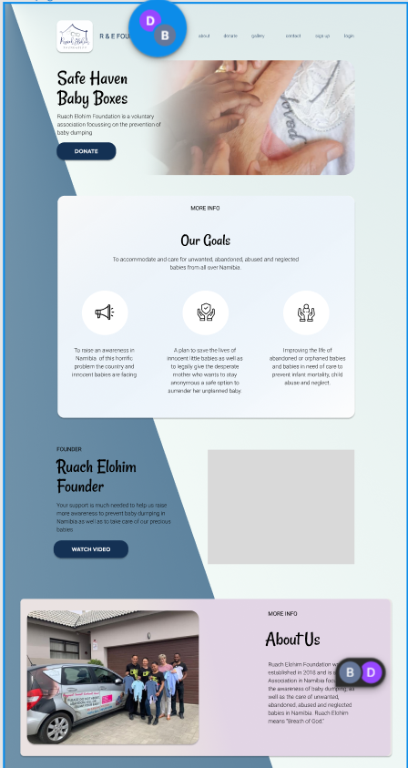
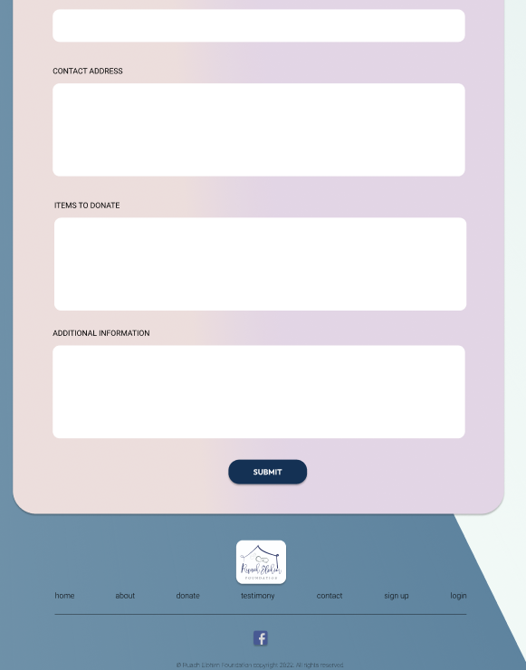

## Individual Reflective Journal

### Project Planning and Proposal Stage 
 

In this stage of the project I took on the role of Scrum master.
I would organise the meetings set meeting agendas and record the meeting minutes.
I created the kanban board and during each meeting we would run through which task we were doing or had completed and update the kanban board accordingly.  

During this stage I also created the design mock-ups for the website  
 

**Key Decisions**  

The adding of a back-end authentication system for an account section where only logged in users can contact the foundation directly.
 
Involved heavily in the decision based around which tech stack to use.
 
Decided on the general design theme to be used throughout the website.
 

**Design Commentary**
 

Coming up with the general theme and color of the website is but one of the design features I was involved in. We had already been given the logo design of the company and I wanted to inherit some of the logos look and feel and continue it through to the website. As this website is for a foundation looking after babies, I decided to incorporate light blue’s and pinks as I believed that would represent colors usually associated with babies.
 

Below are some screen shots of the websites mock-ups.
 

**Reflection on the Teamwork**
 
As a team I believe we communicated effectively and always made sure that each team member had a task to do. Using Microsoft Teams as our main communication portal worked really well. Also having concise meeting meeting minutes allowed any team member to reference back what was needed of them and also if a team member was not present at the meeting they could use the meeting minutes file to catch up on what may have been missed.
 
We used Whiteboard as a collaboration tool for any design ideas and notes but I feel as an improvement we could have used this more in having each team member brainstorm on key design decisions to help make the most out of having multiple ideas and views on what the product will and feel like.
 

**Cultural Issues Addressed**
 
As this website is being built for a voluntary foundation whose sole focus is preventing newborn infants from being abanndoned or simply dumped in the streets of Namibia, it will not only help raise awareness of this real life cultural and social issue but will also help provide a means for anyone worldwide to do their part in helping make sure this does not happen.
 

### Project Implementation Stage 
 

**1st Sprint**
 
This consisted of the database creation and population, initial project setup with boiler plate code, backend server setup and as well as the addition of some front end components.
 

**Lesson Learnt**
 
The most valuable lesson learnt this sprint for myself would have been using the Tailwind CSS framework. As I had not used this framework previously, having this in the project allowed me to learn a great deal about the framework.
 

**Frustrations**
 
As I learnt alot about Tailwind CSS this sprint I also became frustrated with it in some instances. One of note being adding the package itself to the React project. We were unable to achieve this correctly even after following the official docs step by step. Therefore we had resort to using the framework in the CDN version.
 

**Role**
 
My role in this sprint was a shared role consisting of scrum master and front end engineer.
 

**Tasks Done**
 
The tasks I completed during this sprint were:
- Creating the Footer component
- Creating the Homepage
- Creating the About Page
- Styling the Footer component and making it fully responsive
- Styling the Homepage and making it fully responive
- Styling the About page and making it fully responsive
- Taking multiple meeting minutes
- Updating the Kanban board
 

**Implementation Commentary**
 
One feature I implemented during this sprint was that of the entire websites footer component. I created this as a separate react component that will be rendered at the bottom of every page in the website. I styled this component using the tailwind css framework and the mobile first approach.
 

**Team Reflection**
 
Mostly this sprint finished without any large issues. The team communicated effectively using our chosen portal. Each individual had their own tasks to complete and neither of these become conflicting with one another. We did have a merging conflict when it came to merging packages that had been installed but we were able to sort this out through an online meeting.
 

**2nd Sprint**
 
This sprint consisted of adding the database connection to the server, creating the backend required for our CRUD operations. Adding most of the websites content and including form submission handling.
 

**Lessons Learnt**
 
During this sprint one of the lessons I took from it would have been when collaborating with git using node packages we came across some errors merging branches that had different packages installed on them. As github does not allow reviewing node package files for merge conflicts, it is best to leave out any local packages when committing to source control and only list dependencies.
 
Another lesson learnt was that of becoming familiar with adding props inside of react functional components that can then be accessed when calling the component. This came into use when using the Modal video player I created for our home screen.
 

**Frustrations**
 
The main frustrations with this sprint would have been dealing with the merge confilcts in terms of our local package files.
 

**Role**
 
My role in this sprint was a shared role consisting of scrum master and front end engineer.
 

**Tasks Done**
 
- Create a Modal for the homepage video
- Finish the homepage content
- Finish the about page content
- Create the Contact form handling functionality
- Create the Donate form functionality
- Setup the web service email handling webhooks
- Update kanban board after meetings
 

**Implementation Commentary**
 
One feature that I implemented during this sprint was the video player Modal for the homepage. I created a custom component to act as the Modal and then using props I am able to call upon this modal when a certain state is met.
 

**Testing Commentary**
 
Another feature I implemented was that of the contact and donate form submission handling. When it came to testing this feature I wrote a series of small user tests and added a test for multiple browsers. I recorded my results on a table inside of a testing log document for the said feature.
 

**3rd Sprint**
 
This sprint consisted of adding the CRUD operations to the testimonials page, adding the authentication functionality and finishing off all styling.
 

**Lessons Learnt**
 
I learnt that working as a team in a peer coding session proved to be quite effective when more than one team member had been tasked to work on a single feature.
 

**Frustrations**
 
I found it rather frustrating how some browsers would produce errors on a section of code whereas others could be completely fine.
 

**Role**
 
My role in this sprint consisted of front-end engineer and git lead.
 

**Tasks Done**
 
- Assisted our backend engineer in implementing the authentication functionality
- Dealt with source control branch merging and any conflicts
- Added styling changes throughout the web application
 

**Implementation Commentary**
 
One feature I contributed heavily to during this sprint would be that of the authentication functionality particular the handling of the JWT’s used for authentication in the frontend.
 
This was implemented by setting the JWT as a token in the browsers local storage after validation had been completed on the users credentials. We then set that token into the header to then be verified by the API that has the middleware verification function attached to it.
 

**Team Relection**
 
For the most part our team came across no conflicting issues during this sprint. As this was the first sprint where more than one team member worked on a single feature it became difficult deciding how we would collaborate without conflictions or doubling up on work. We decided to conduct a series of peer coding sessions whilst working on this feature and this proved to be very effective.
 

### Project Presentation Stage
 

**Tasks Completed**
 
- Provided a voice over audio for our slideshow detailing the decisions and challenges faced.
- Presented the first few pages of our web application demo to the client/tutor.
 

**Team Reflection**
 
During our presentation I believe as a team we were well prepared with pre recorded slides along with planning who will speak at what stage during the demo.
 
We handled feedback well and even noted about what we could have done or done differently next time.

